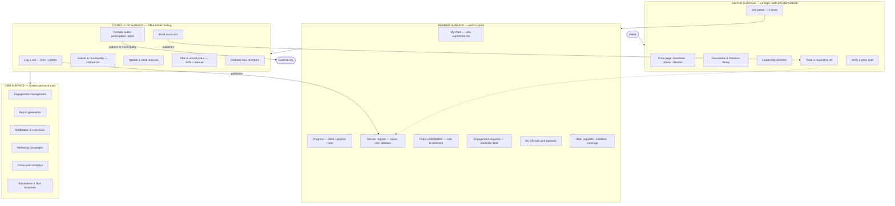
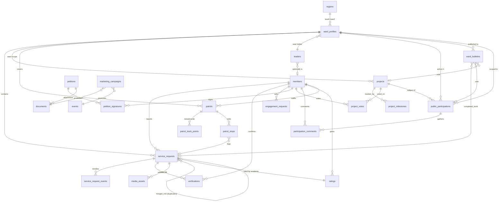
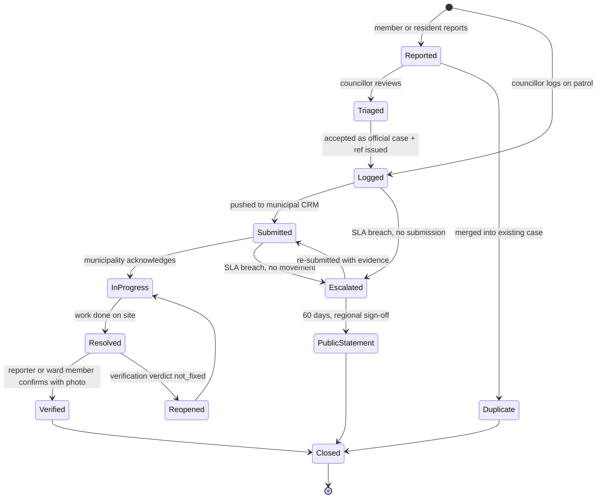
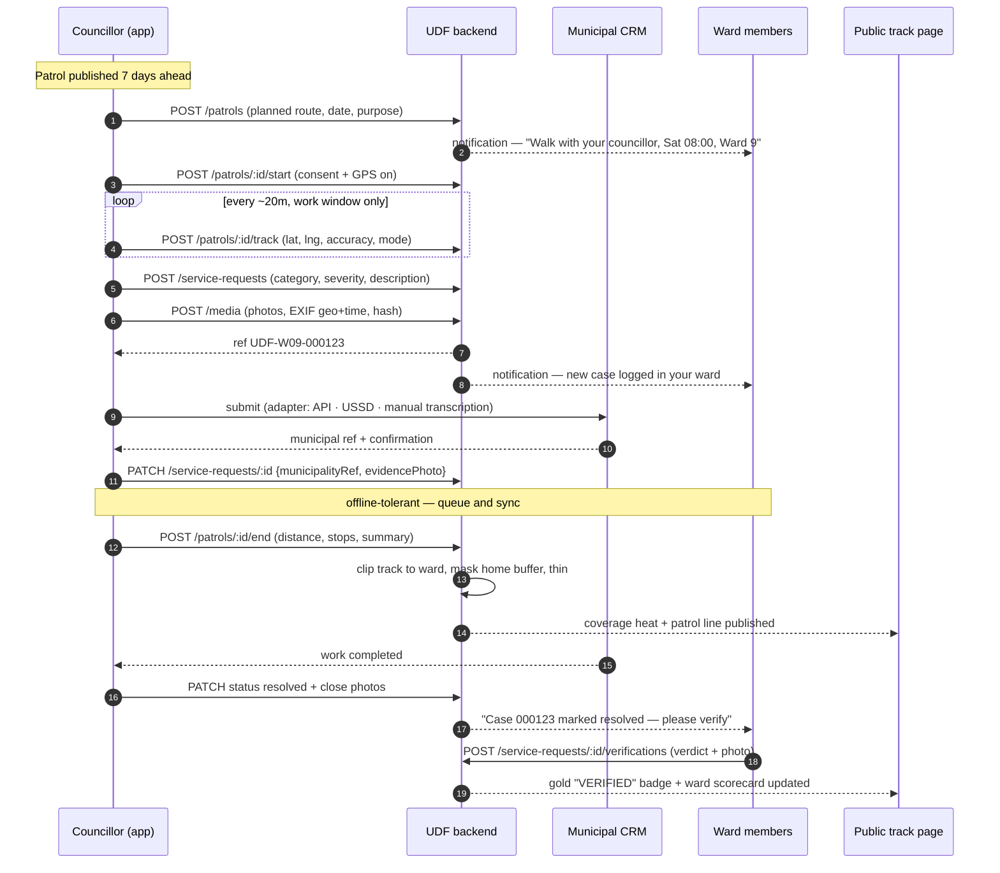
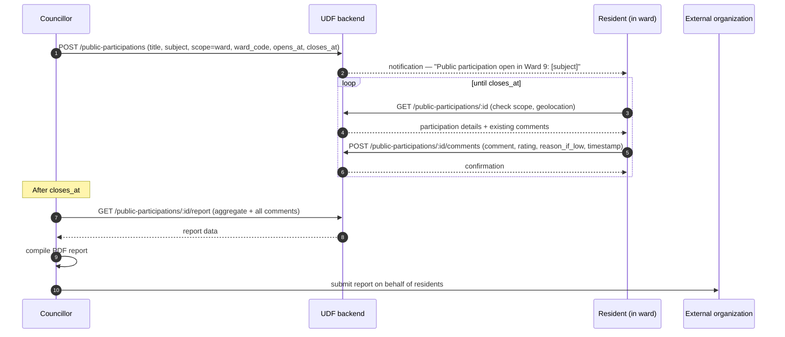
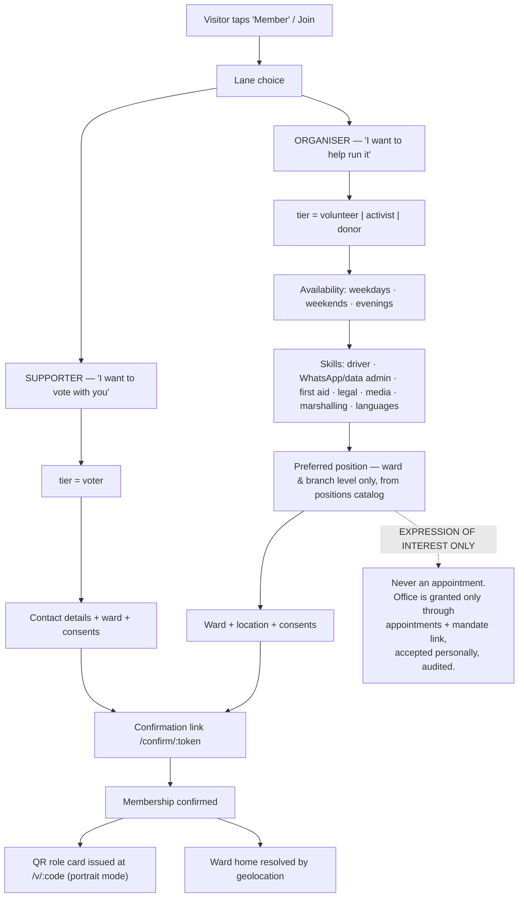
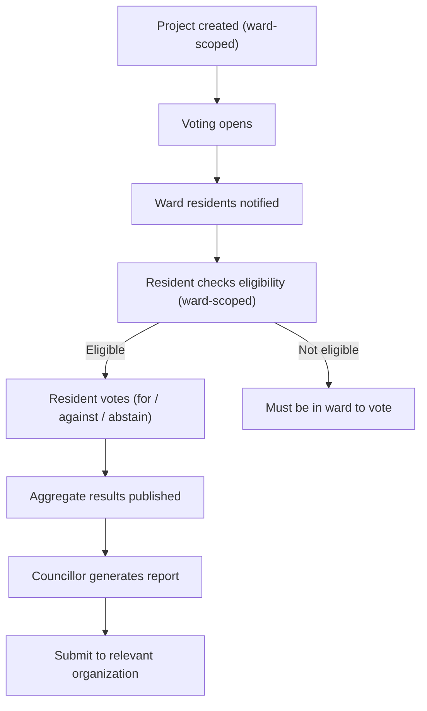

# UDF Enterprise Service Delivery Platform — Design Document

**Version**: 2.0  
**Status**: Design Complete  
**Date**: 2026-09-10  
**Scope**: Enterprise-grade service delivery, public participation, and member engagement platform

---

## 1. Executive Summary

The UDF Enterprise Service Delivery Platform is a ward-centric, mobile-first system that transforms how a political party delivers services, engages residents, and holds representatives accountable. It combines:

- **Public-facing transparency**: Any resident can track a service request by reference number, see a councillor's scorecard, and verify completed work.
- **Member engagement**: Ward-scoped information, project voting, public participation, and direct councillor interaction.
- **Councillor tooling**: Service request logging, patrol tracking (GPS breadcrumb + manual check-ins), municipal CRM integration, and member onboarding.
- **Enterprise CRM**: System administrators manage engagements, generate reports, and oversee the entire operation.
- **Marketing & public participation**: Dedicated modules for campaign engagement and structured resident input with ward-scoped voting.

The platform is built on three principles:
1. **Reference numbers build trust** — every logged issue becomes a trackable, verifiable artefact.
2. **Ward-first, not region-first** — all information resolves to the resident's ward; geolocation + manual override.
3. **Evidence over assertion** — photos with EXIF geo/time + hash, independent verification, published scorecards.

---

## 2. System Overview

### 2.1 Personas & Surfaces



### 2.2 Core Value Proposition

**For residents**: Proof of work before membership. A resident who has never joined can still type a reference number and see a status. That single public page is the strongest recruitment argument.

**For members**: Ward identity is the emotional core. "Who represents me, what's happening, what's the plan, how can I help" — all resolved to your ward, with geolocation + manual override.

**For councillors**: A defensible record. Two-column scorecard: "what we logged" vs "what the municipality fixed." Same data, completely different narrative. The councillor becomes the diligent one; the municipality becomes the defendant.

**For the party**: An executable constitution. The manifesto promises a recall mechanism (two-thirds branch vote). The petition engine delivers it. Ship it and you are the only party whose constitution is *executable*.

---

## 3. Domain Model

### 3.1 Core Entities (Existing)

- `users` — staff authentication (sealed PII, blind indexes)
- `members` — party membership (tier, status, ward, location, sealed PII)
- `regions` — hierarchical (country → region → district → ward) with MultiPolygon geom
- `events` — party gatherings (rallies, meetings, training, canvasses)
- `posts` — communications (news, press, highlights, community notes, service delivery)
- `positions` — role catalog (14 roles from PRESIDENT to OBSERVER)
- `appointments` — mandates (member + position + ward + status + mandate acceptance)
- `notifications` — in-app alerts (targeted + broadcast)
- `member_tokens` — confirmation links (register + mandate)
- `audit_log` — hash-chained, append-only

### 3.2 New Entities (Phases 1–5)

**Phase 1 — Foundation**
- `ward_profiles` — councillor seat, municipality, population, registered voters, scorecard cache (ward rows live in `regions` with `level='ward'`)
- `leaders` — public-facing directory (president, mayoral candidate, councillors, candidates)
- `documents` — party documents library (constitution, manifesto PDF, petition forms, policies), versioned
- `petitions` — title, body, target, scope (ward/region/national), opens/closes, signature goal, status
- `petition_signatures` — petition_id, member_id, signed_at, ward_code
- `enquiries` — "I need more information" leads (not members)
- `role_badges` — extend member QR to show position badges

**Phase 2 — Core Value**
- `service_requests` — the core: ref_no (UDF-W09-000123), category, severity, status, location, ward, reporter, photos, municipality_ref, SLA_due_at
- `service_request_events` — append-only timeline (status transitions with actor, note, photos)
- `media_assets` — photos with EXIF geo+time, hash, storage key
- `public_participations` — structured resident input on projects/issues (ward-scoped)
- `participation_comments` — resident comments with mandatory reason for ratings ≤2
- `ratings` — 1-5 scale on councillor work, with mandatory explanation for low ratings + timestamps
- `ward_bulletins` — councillor's ward-specific news feed (news, vacancies, completed work, votes)
- `ward_dashboard` — councillor's front page (scorecard, active cases, upcoming votes, recent bulletins, quick actions)

**Phase 3 — Accountability**
- `verifications` — member follow-up on closed cases (verdict + photo)
- `projects` — ward & metro programme (stage, progress, budget, milestones)
- `project_milestones` — date, title, status
- `project_votes` — resident voting on projects (public participation)

**Phase 4 — Movement**
- `patrols` — councillor oversight walks (planned route, mode, purpose)
- `patrol_track_points` — GPS breadcrumb (thinned server-side, ward-clipped, home-buffer masked, 2-3m accuracy, reverse geocoded to street address)
- `patrol_stops` — a stop within a patrol linked to a service_request
- `engagement_requests` — member asks for councillor/PAC time (type, preferred slots, status)
- Metro-wide overview (cross-ward analytics, visual comparison of similar cases/incidents)
- Heat map enhancements (color-coded by issue category, filtering by type/severity/status/date)
- Media capture enhancements (voice notes, video, one-click photo, offline sync queue)
- Reverse geocoding service (GPS → street address)

**Phase 5 — Integration**
- `municipal_gateways` — adapter config per metro (API credentials, submission method)
- `marketing_campaigns` — marketing module for UDF engagements
- `recall_petitions` — two-thirds branch vote mechanism (extends petitions)

### 3.3 Entity Relationships



---

## 4. Functional Requirements

### 4.1 Visitor Surface (Public)

**Front page**
- Manifesto, vision, mission (from `MANIFESTO` in `public/content.ts`)
- Documents & petitions library (downloadable PDFs, forms)
- Leadership directory (president, mayoral candidate, councillors with photos + bios)
- Join portal with two lanes (supporter vs organiser)
- Track a request by reference number (no login required)
- Verify a party card (`/v/:code`)

**Track a request**
- Input: reference number (UDF-W09-000123)
- Output: status, timeline, photos, verification verdict, councillor scorecard
- Shareable via WhatsApp as text-only page

### 4.2 Member Surface

**Ward home**
- Resolved by geolocation (ST_Intersects against `wards.geom`) + manual override
- Who represents me (councillor profile, contact, scorecard)
- **Ward bulletin / news feed** (councillor's published content: news, vacancies, completed work, votes)
- Ward projects (done / pipeline / next)
- Service register (cases logged, statuses, reference numbers)
- Public participation (active processes in ward, vote & comment)
- Engagement requests (ask for councillor time)
**Heat maps** (requests, incidents, councillor coverage)
- Color-coded by issue category (water=blue, roads=orange, power=yellow, sanitation=green, safety=red, other=gray)
- Filtering: category, severity, status, date range
- Ward-level heat map (single ward)
- Metro-wide heat map (all wards together, visual comparison)
- My QR role card (portrait mode, digital)

**Metro overview**
- Aggregate statistics across all wards (total cases, resolved, overdue, verification rate)
- Visual comparison of similar cases/incidents across wards
- Trend analysis (week-over-week, month-over-month)
- Cross-ward performance ranking
- Toggle between ward-specific view and metro overview

**Councillor's ward dashboard**
- Ward scorecard (two columns: logged vs fixed, days outstanding, verification rate)
- Active cases (logged, submitted, in_progress, overdue)
- Upcoming votes (active public participations in ward)
- Recent bulletins (what councillor has published)
- Quick actions (log case, plan patrol, publish bulletin, onboard member)

**Ward bulletin / news feed**
- Councillor publishes ward-specific content to keep residents informed
- Content types:
  - **Local news** — what's happening in the surrounding area
  - **Vacancies** — job opportunities, tender notices, public participation opportunities
  - **Completed work** — "we fixed this" announcements (links to verified service requests)
  - **Vote announcements** — active public participations, project votes (links to public_participations)
- Residents see bulletins on their ward home (member surface) and public track page
- Enterprise standard: versioned, auditable, can be taken down with moderation trail

**Public participation**
- Ward-scoped: must be in that ward to comment on issues that affect them
- Scope selection: specific ward | open to all | open to metro
- Structured input: comment + rating (1-5) + mandatory reason for ≤2 + timestamp
- Councillor compiles report from platform, submits to relevant organization
- Knows it's residents within that area doing the participation

**Project voting**
- Where there are projects within a community, residents vote to ensure public participation
- Voting is ward-scoped (only ward residents can vote on ward projects)
- Results published, councillor sees aggregate + can generate report

**Rating system**
- 1-5 scale on councillor work (5 = excellent, 1 = poor)
- If rating ≤ 2: mandatory reason (why they said it, what needs to improve, what they picked up)
- Timestamp (if not current, specific date/time when something happened)
- Independent verification (reporter verifies first → after 7 days any ward member may → councillor may never verify their own case)

### 4.3 Councillor Surface

**Service request logging**
- Structured form: category, severity, description, location, photos
- Reference number issued at `Logged`
- Submit to municipality (adapter: API / USSD / manual transcription)
- Capture municipal ref + confirmation photo
- Update & close statuses

**Patrol tracking**
- Plan & publish route 7 days ahead
- Start patrol (consent + GPS on)
- GPS breadcrumb (thinned to ~20m, ward-clipped, home-buffer masked, auto-stop outside declared window)
- **High-precision GPS** (target: 2-3m accuracy) with reverse geocoding to street address
- **Easy media capture** during patrol:
  - One-click photo (with EXIF geo+time, hash)
  - Video recording (with geo+time, hash)
  - Voice notes (audio recording with geo+time, hash)
  - All media attached to patrol stop or service request
  - Offline capture with sync queue (township coverage unreliable)
- Manual check-ins (photo + note at a point) — fallback where data cost/battery is constraint
- End patrol (distance, stops, summary)
- Coverage heat map published (color-coded by issue category, filtering by type/severity/status/date)

**Ward scorecard**
- Two columns: "what we logged" vs "what the municipality fixed"
- Days outstanding, median time-to-resolve, verification rate
- Public-facing (residents can see), published as evidence against the municipality

**Metro overview** (for regional/national admin)
- Aggregate statistics across all wards (total cases, resolved, overdue, verification rate)
- Visual comparison of similar cases/incidents across wards
- Trend analysis (week-over-week, month-over-month)
- Cross-ward performance ranking
- Heat map: all wards together, color-coded by issue category, filtering by type/severity/status/date
- Toggle between ward-specific view and metro overview

**Member onboarding**
- Councillor can register new members directly (capture contact details, ward, tier)
- Guide residents to the platform (generate join links, QR codes)
- "Kite the necessity" — direct residents to what's needed (volunteer, activist, donor)

**Public participation report**
- Compile all comments, ratings, votes from a public participation process
- Generate report (PDF) with aggregate + individual comments
- Submit to relevant organization on behalf of residents

### 4.4 CRM Surface (System Administrators)

**Engagement management**
- View all service requests across wards
- Escalation queue (SLA breaches, overdue cases)
- Moderation & take-down (reuse `posts` pattern)
- Cross-ward analytics (comparison, trends)

**Report generation**
- Ward scorecards (per councillor, per ward)
- Service request reports (logged, submitted, resolved, verified, overdue)
- Public participation reports (comments, ratings, votes)
- Marketing campaign reports (engagement, reach)
- Custom reports (date range, ward, category, status)

**Marketing module**
- Campaigns for UDF engagements (rallies, canvasses, fundraisers)
- Promote documents, events, petitions
- Track engagement (clicks, shares, conversions)

### 4.5 Public Participation & Voting

**Public participation process**
- Created by councillor or national admin
**Scope**: ward | region | metro | national
- Subject: project, policy, service delivery issue
- Opens at / closes at (date range)
- Structured input: comment + rating (1-5) + mandatory reason for ≤2 + timestamp
- Ward-scoped: must be in that ward to comment (geolocation check)
- Councillor compiles report, submits to relevant organization

**Ward bulletin / news feed**
- Councillor publishes ward-specific content to keep residents informed
- Content types:
  - **Local news** — what's happening in the surrounding area
  - **Vacancies** — job opportunities, tender notices, public participation opportunities
  - **Completed work** — "we fixed this" announcements (links to verified service requests)
  - **Vote announcements** — active public participations, project votes (links to public_participations)
- Residents see bulletins on their ward home (member surface) and public track page
- Enterprise standard: versioned, auditable, can be taken down with moderation trail

**Project voting**
- Where there are projects within a community, residents vote
- Voting is ward-scoped (only ward residents can vote)
- Results published (for / against / abstain)
- Councillor sees aggregate + can generate report

### 4.6 Rating & Feedback System

**Rating scale**
- 5 = Excellent
- 4 = Good
- 3 = Acceptable
- 2 = Needs improvement (mandatory reason)
- 1 = Poor (mandatory reason)

**Mandatory reason for ≤2**
- Why they said it (what went wrong)
- What needs to improve
- What they picked up (specific observations)
- Timestamp (if not current, specific date/time when something happened)

**Verification**
- Reporter verifies first (they know if the bell works)
- After 7 days, any ward member may verify
- Councillor may never verify their own case
- Verdict: fixed / not_fixed / partial + photo

---

## 5. Workflows

### 5.1 Service Request Lifecycle



**Key decisions**:
- Reference number issued at `Logged`, format `UDF-W09-000123`
- Two entry doors: members *report*, councillors *log*
- Duplicate handling: merge, keep `report_count` ("Reported by 47 residents")
- Escalation ladder: 30 days → regional organiser · 60 days → public statement · 90 days → petition
- SLA clocks per category (water outage ≠ pothole ≠ streetlight)

### 5.2 Councillor Patrol Workflow



### 5.3 Public Participation Workflow



**Ward-scoping**:
- Resident must be in that ward to comment (geolocation check via `ST_Intersects`)
- Manual override available (GPS is wrong in dense settlements)
- Scope selection: specific ward | open to all | open to metro

### 5.4 Registration & Onboarding



**Councillor onboarding**:
- Councillor can register new members directly (capture contact details, ward, tier)
- Generate join links, QR codes for residents
- Guide residents to what's needed (volunteer, activist, donor)

### 5.5 Project Voting Workflow



---

## 6. Data Model

### 6.1 Schema Extensions

**`regions` table** — add ward rows:
```sql
INSERT INTO regions (code, name, parent_code, level, geom) VALUES
  ('ZA-GP-W09', 'Ward 9', 'ZA-GP-JHB-D3', 'ward', <MultiPolygon>),
  ...
```

**`members` table** — change `ward TEXT` → `ward_code TEXT REFERENCES regions(code)` with backfill.

**`members` table** — add `ward_code` to JWT claim for ward-scoped access.

### 6.2 New Tables

**`ward_profiles`**
```sql
CREATE TABLE ward_profiles (
  ward_code TEXT PRIMARY KEY REFERENCES regions(code),
  municipality TEXT NOT NULL,
  councillor_member_id UUID REFERENCES members(id),
  population INTEGER,
  registered_voters INTEGER,
  scorecard_cache JSONB,
  created_at TIMESTAMPTZ NOT NULL DEFAULT now(),
  updated_at TIMESTAMPTZ NOT NULL DEFAULT now()
);
```

**`service_requests`**
```sql
CREATE TABLE service_requests (
  id UUID PRIMARY KEY DEFAULT gen_random_uuid(),
  ref_no TEXT UNIQUE NOT NULL, -- UDF-W09-000123
  category TEXT NOT NULL, -- water|power|roads|sanitation|housing|safety|other
  severity TEXT NOT NULL, -- info|report|urgent
  title TEXT NOT NULL,
  description TEXT,
  status TEXT NOT NULL DEFAULT 'reported', -- reported|triaged|logged|submitted|in_progress|resolved|verified|closed|escalated|duplicate|reopened
  location GEOGRAPHY(Point, 4326),
  ward_code TEXT REFERENCES regions(code),
  reporter_member_id UUID REFERENCES members(id),
  reporter_contact JSONB, -- sealed PII
  municipality_ref TEXT,
  sla_due_at TIMESTAMPTZ,
  report_count INTEGER NOT NULL DEFAULT 1, -- duplicate count
  merged_into UUID REFERENCES service_requests(id),
  created_by UUID REFERENCES users(id),
  created_at TIMESTAMPTZ NOT NULL DEFAULT now(),
  updated_at TIMESTAMPTZ NOT NULL DEFAULT now()
);
```

**`service_request_events`**
```sql
CREATE TABLE service_request_events (
  id UUID PRIMARY KEY DEFAULT gen_random_uuid(),
  service_request_id UUID NOT NULL REFERENCES service_requests(id) ON DELETE CASCADE,
  from_status TEXT,
  to_status TEXT NOT NULL,
  actor_member_id UUID REFERENCES members(id),
  actor_user_id UUID REFERENCES users(id),
  note TEXT,
  photos UUID[], -- media_assets.id
  created_at TIMESTAMPTZ NOT NULL DEFAULT now()
);
```

**`media_assets`**
```sql
CREATE TABLE media_assets (
  id UUID PRIMARY KEY DEFAULT gen_random_uuid(),
  storage_key TEXT NOT NULL,
  content_type TEXT NOT NULL, -- image/jpeg|video/mp4|audio/m4a|audio/ogg
  capture_mode TEXT NOT NULL, -- photo|video|voice_note|audio
  exif_geo GEOGRAPHY(Point, 4326),
  exif_time TIMESTAMPTZ,
  accuracy_m NUMERIC, -- GPS accuracy (2-3m for high-precision)
  street_address TEXT, -- reverse geocoded from exif_geo
  duration_seconds INTEGER, -- for video/audio
  hash CHAR(64) NOT NULL, -- SHA-256
  created_by UUID REFERENCES users(id),
  created_at TIMESTAMPTZ NOT NULL DEFAULT now()
);
```

**`public_participations`**
```sql
CREATE TABLE public_participations (
  id UUID PRIMARY KEY DEFAULT gen_random_uuid(),
  title TEXT NOT NULL,
  subject TEXT,
  scope TEXT NOT NULL, -- ward|region|metro|national
  ward_code TEXT REFERENCES regions(code),
  region_code TEXT REFERENCES regions(code),
  opens_at TIMESTAMPTZ NOT NULL,
  closes_at TIMESTAMPTZ NOT NULL,
  status TEXT NOT NULL DEFAULT 'open', -- open|closed|submitted|answered
  created_by UUID REFERENCES users(id),
  created_at TIMESTAMPTZ NOT NULL DEFAULT now()
);
```

**`participation_comments`**
```sql
CREATE TABLE participation_comments (
  id UUID PRIMARY KEY DEFAULT gen_random_uuid(),
  participation_id UUID NOT NULL REFERENCES public_participations(id) ON DELETE CASCADE,
  member_id UUID NOT NULL REFERENCES members(id),
  ward_code TEXT REFERENCES regions(code),
  comment TEXT NOT NULL,
  rating INTEGER CHECK (rating BETWEEN 1 AND 5),
  reason_if_low TEXT, -- mandatory if rating <= 2
  timestamp TIMESTAMPTZ, -- when something happened (if not current)
  created_at TIMESTAMPTZ NOT NULL DEFAULT now()
);
```

**`ward_bulletins`**
```sql
CREATE TABLE ward_bulletins (
  id UUID PRIMARY KEY DEFAULT gen_random_uuid(),
  ward_code TEXT NOT NULL REFERENCES regions(code),
  councillor_member_id UUID NOT NULL REFERENCES members(id),
  kind TEXT NOT NULL, -- news|vacancy|completed_work|vote|announcement
  title TEXT NOT NULL,
  body TEXT,
  -- Linked entities (optional, depending on kind)
  service_request_id UUID REFERENCES service_requests(id), -- for completed_work
  public_participation_id UUID REFERENCES public_participations(id), -- for vote
  project_id UUID REFERENCES projects(id), -- for vote
  -- Metadata
  vacancy_type TEXT, -- job|tender|public_participation (for kind=vacancy)
  vacancy_deadline DATE, -- application deadline (for kind=vacancy)
  vacancy_contact JSONB, -- sealed PII or public contact (for kind=vacancy)
  -- Status
  status TEXT NOT NULL DEFAULT 'published', -- draft|published|taken_down
  take_down_reason TEXT, -- moderation trail
  taken_down_at TIMESTAMPTZ,
  taken_down_by UUID REFERENCES users(id),
  published_at TIMESTAMPTZ NOT NULL DEFAULT now(),
  created_by UUID REFERENCES users(id),
  created_at TIMESTAMPTZ NOT NULL DEFAULT now(),
  updated_at TIMESTAMPTZ NOT NULL DEFAULT now()
);
CREATE INDEX ward_bulletins_ward_idx ON ward_bulletins (ward_code);
CREATE INDEX ward_bulletins_kind_idx ON ward_bulletins (kind);
CREATE INDEX ward_bulletins_status_idx ON ward_bulletins (status);
CREATE INDEX ward_bulletins_published_idx ON ward_bulletins (published_at DESC);
```

**`ratings`**
```sql
CREATE TABLE ratings (
  id UUID PRIMARY KEY DEFAULT gen_random_uuid(),
  target_type TEXT NOT NULL, -- service_request|councillor|project
  target_id UUID NOT NULL,
  member_id UUID NOT NULL REFERENCES members(id),
  rating INTEGER NOT NULL CHECK (rating BETWEEN 1 AND 5),
  reason TEXT, -- mandatory if rating <= 2
  timestamp TIMESTAMPTZ, -- when something happened
  created_at TIMESTAMPTZ NOT NULL DEFAULT now(),
  UNIQUE (member_id, target_type, target_id)
);
```

**`verifications`**
```sql
CREATE TABLE verifications (
  id UUID PRIMARY KEY DEFAULT gen_random_uuid(),
  service_request_id UUID NOT NULL REFERENCES service_requests(id),
  member_id UUID NOT NULL REFERENCES members(id),
  verdict TEXT NOT NULL, -- fixed|not_fixed|partial
  photo UUID REFERENCES media_assets(id),
  note TEXT,
  created_at TIMESTAMPTZ NOT NULL DEFAULT now()
);
```

**`projects`**
```sql
CREATE TABLE projects (
  id UUID PRIMARY KEY DEFAULT gen_random_uuid(),
  title TEXT NOT NULL,
  scope TEXT NOT NULL, -- ward|district|region|national
  ward_code TEXT REFERENCES regions(code),
  region_code TEXT REFERENCES regions(code),
  stage TEXT NOT NULL, -- idea|concept|approved|funded|in_progress|delivered|blocked
  progress_pct INTEGER CHECK (progress_pct BETWEEN 0 AND 100),
  budget NUMERIC,
  owner TEXT,
  published BOOLEAN NOT NULL DEFAULT FALSE,
  created_by UUID REFERENCES users(id),
  created_at TIMESTAMPTZ NOT NULL DEFAULT now(),
  updated_at TIMESTAMPTZ NOT NULL DEFAULT now()
);
```

**`project_votes`**
```sql
CREATE TABLE project_votes (
  project_id UUID NOT NULL REFERENCES projects(id) ON DELETE CASCADE,
  member_id UUID NOT NULL REFERENCES members(id),
  vote TEXT NOT NULL, -- for|against|abstain
  created_at TIMESTAMPTZ NOT NULL DEFAULT now(),
  PRIMARY KEY (project_id, member_id)
);
```

**`patrols`**
```sql
CREATE TABLE patrols (
  id UUID PRIMARY KEY DEFAULT gen_random_uuid(),
  councillor_member_id UUID NOT NULL REFERENCES members(id),
  ward_code TEXT REFERENCES regions(code),
  mode TEXT NOT NULL, -- walk|drive
  purpose TEXT, -- oversight|fault-visit|community-meeting|canvass
  planned_route JSONB, -- GeoJSON LineString
  planned_date DATE,
  started_at TIMESTAMPTZ,
  ended_at TIMESTAMPTZ,
  distance_m NUMERIC,
  summary TEXT,
  status TEXT NOT NULL DEFAULT 'planned', -- planned|active|completed|cancelled
  created_at TIMESTAMPTZ NOT NULL DEFAULT now()
);
```

**`patrol_track_points`**
```sql
CREATE TABLE patrol_track_points (
  id UUID PRIMARY KEY DEFAULT gen_random_uuid(),
  patrol_id UUID NOT NULL REFERENCES patrols(id) ON DELETE CASCADE,
  seq INTEGER NOT NULL,
  location GEOGRAPHY(Point, 4326) NOT NULL,
  accuracy_m NUMERIC, -- GPS accuracy (target: 2-3m)
  speed NUMERIC,
  street_address TEXT, -- reverse geocoded
  recorded_at TIMESTAMPTZ NOT NULL
);
```

**`patrol_stops`**
```sql
CREATE TABLE patrol_stops (
  id UUID PRIMARY KEY DEFAULT gen_random_uuid(),
  patrol_id UUID NOT NULL REFERENCES patrols(id) ON DELETE CASCADE,
  location GEOGRAPHY(Point, 4326) NOT NULL,
  service_request_id UUID REFERENCES service_requests(id),
  note TEXT,
  photo UUID REFERENCES media_assets(id),
  arrived_at TIMESTAMPTZ NOT NULL
);
```

**`engagement_requests`**
```sql
CREATE TABLE engagement_requests (
  id UUID PRIMARY KEY DEFAULT gen_random_uuid(),
  member_id UUID NOT NULL REFERENCES members(id),
  councillor_member_id UUID REFERENCES members(id),
  type TEXT NOT NULL, -- meeting|site-visit|complaint-escalation|home-visit
  preferred_slots JSONB, -- [{date, time_range}]
  ward_code TEXT REFERENCES regions(code),
  status TEXT NOT NULL DEFAULT 'requested', -- requested|acknowledged|scheduled|completed|declined
  notes TEXT,
  created_at TIMESTAMPTZ NOT NULL DEFAULT now(),
  updated_at TIMESTAMPTZ NOT NULL DEFAULT now()
);
```

**`leaders`**
```sql
CREATE TABLE leaders (
  id UUID PRIMARY KEY DEFAULT gen_random_uuid(),
  member_id UUID REFERENCES members(id),
  position_code TEXT REFERENCES positions(code),
  ward_code TEXT REFERENCES regions(code),
  region_code TEXT REFERENCES regions(code),
  photo UUID REFERENCES media_assets(id),
  bio TEXT,
  contact_public JSONB, -- public channel (WhatsApp, email)
  socials JSONB, -- {twitter, facebook, instagram}
  public BOOLEAN NOT NULL DEFAULT TRUE,
  created_at TIMESTAMPTZ NOT NULL DEFAULT now(),
  updated_at TIMESTAMPTZ NOT NULL DEFAULT now()
);
```

**`documents`**
```sql
CREATE TABLE documents (
  id UUID PRIMARY KEY DEFAULT gen_random_uuid(),
  title TEXT NOT NULL,
  category TEXT NOT NULL, -- constitution|manifesto|petition_form|policy|ward_structure
  version TEXT,
  storage_key TEXT NOT NULL,
  content_type TEXT NOT NULL,
  published BOOLEAN NOT NULL DEFAULT TRUE,
  created_by UUID REFERENCES users(id),
  created_at TIMESTAMPTZ NOT NULL DEFAULT now(),
  updated_at TIMESTAMPTZ NOT NULL DEFAULT now()
);
```

**`petitions`**
```sql
CREATE TABLE petitions (
  id UUID PRIMARY KEY DEFAULT gen_random_uuid(),
  title TEXT NOT NULL,
  body TEXT,
  target TEXT, -- municipality|province|national
  scope TEXT NOT NULL, -- ward|region|national
  ward_code TEXT REFERENCES regions(code),
  region_code TEXT REFERENCES regions(code),
  opens_at TIMESTAMPTZ,
  closes_at TIMESTAMPTZ,
  signature_goal INTEGER,
  status TEXT NOT NULL DEFAULT 'open', -- open|closed|submitted|answered
  attachment UUID REFERENCES documents(id),
  created_by UUID REFERENCES users(id),
  created_at TIMESTAMPTZ NOT NULL DEFAULT now()
);
```

**`petition_signatures`**
```sql
CREATE TABLE petition_signatures (
  petition_id UUID NOT NULL REFERENCES petitions(id) ON DELETE CASCADE,
  member_id UUID NOT NULL REFERENCES members(id),
  ward_code TEXT REFERENCES regions(code),
  signed_at TIMESTAMPTZ NOT NULL DEFAULT now(),
  PRIMARY KEY (petition_id, member_id)
);
```

**`marketing_campaigns`**
```sql
CREATE TABLE marketing_campaigns (
  id UUID PRIMARY KEY DEFAULT gen_random_uuid(),
  title TEXT NOT NULL,
  description TEXT,
  target_audience JSONB, -- {wards, tiers, regions}
  start_date DATE,
  end_date DATE,
  status TEXT NOT NULL DEFAULT 'draft', -- draft|active|completed
  promoted_documents UUID[],
  promoted_events UUID[],
  engagement_metrics JSONB, -- {clicks, shares, conversions}
  created_by UUID REFERENCES users(id),
  created_at TIMESTAMPTZ NOT NULL DEFAULT now(),
  updated_at TIMESTAMPTZ NOT NULL DEFAULT now()
);
```

### 6.3 ER Diagram

See Section 3.3.

---

## 7. Permissions & Roles

### 7.1 Role Matrix

| Role | Scope | Description |
|---|---|---|
| `national_admin` | National | Full system access, CRM, marketing, escalations |
| `regional_organizer` | Region | Regional events, posts, appointments, notifications |
| `local_coordinator` | District/Ward | Branch events, posts, member read |
| `ward_councillor` | Ward | Log cases, patrol, update statuses, onboard members, compile public participation reports |
| `analyst` | National/Region | Geo read only (no PII) |
| `member` | Ward | Read ward info, report cases, verify, vote, comment, rate |

### 7.2 Permission Grants

**New permissions**:
**`case:log`** — log a service request (councillor + member)
- `case:update` — update case status (councillor)
- `case:close` — close a case (councillor)
- `case:escalate` — escalate a case (regional+ organizer)
- `case:read` — read cases (member, ward-scoped)
- `patrol:write` — create/update patrols (councillor)
- `patrol:read` — read patrols (member, ward-scoped)
- `project:write` — create/update projects (regional+ organizer)
- `project:read` — read projects (member, ward-scoped)
- `petition:write` — create petitions (regional+ organizer)
- `petition:sign` — sign petitions (member)
- `leader:write` — manage leadership directory (national admin)
- `document:write` — manage documents (national admin)
- `verify:write` — verify a case (member, ward-scoped)
- `participation:write` — create public participations (councillor, regional+ organizer)
- `participation:comment` — comment on participations (member, ward-scoped)
- `rating:write` — rate councillor work (member, ward-scoped)
- `engagement:write` — request councillor engagement (member)
- `bulletin:write` — publish ward bulletins (councillor, ward-scoped)
- `bulletin:read` — read ward bulletins (member, ward-scoped)
- `marketing:write` — manage marketing campaigns (national admin)
- `report:generate` — generate reports (councillor, regional+ organizer, national admin)
- `overview:read` — read metro-wide overview (regional+ organizer, national admin)

**`Role.MEMBER`** — currently grants nothing. Add:
- `case:read` (ward-scoped)
- `project:read` (ward-scoped)
- `patrol:read` (ward-scoped)
- `verify:write` (ward-scoped)
- `engagement:write`
- `participation:comment` (ward-scoped)
- `rating:write` (ward-scoped)
- `petition:sign`
- `bulletin:read` (ward-scoped)

**New role `WARD_COUNCILLOR`**:
- All `MEMBER` permissions
- `case:log`, `case:update`, `case:close` (ward-scoped)
- `patrol:write` (ward-scoped)
- `participation:write` (ward-scoped)
- `bulletin:write` (ward-scoped)
- `report:generate` (ward-scoped)
- `engagement:read` (ward-scoped)

**`Role.REGIONAL_ORGANIZER`** — add:
- `overview:read` (metro-wide view, cross-ward analytics)

### 7.3 Ward-Scoped Access

**JWT claim**: add `wardCode` to member JWT.

**Scope resolution**:
- If `wardCode` present in JWT → ward-scoped
- If `regionCodes` present → region-scoped
- If neither → national scope

**Ward-scoped queries**:
- All member-facing reads (cases, projects, patrols, participations) filter by `ward_code = :wardCode`
- Councillor writes (log case, update status, patrol) filter by `ward_code = :wardCode`
- Public participation comments require geolocation check (`ST_Intersects`) against `ward_code`

---

## 8. Integration Points

### 8.1 Municipal CRM Gateway

**Submission method**: Manual transcription only (no API integration).

**Workflow**:
1. Councillor logs service request in UDF app
2. Councillor contacts municipality (phone, email, in-person)
3. Municipality provides reference number
4. Councillor captures municipal ref in UDF app + uploads photo of confirmation (email, SMS, call-centre screenshot)
5. System tracks municipal ref as audit trail

**Long-term**: If municipality exposes API, implement `MunicipalGateway` adapter interface:
```typescript
interface MunicipalGateway {
  metro: string; // Cape Town | Joburg | eThekwini | etc.
  submit(request: ServiceRequest): Promise<{ municipalRef: string; confirmation: string }>;
  checkStatus(municipalRef: string): Promise<{ status: string; notes?: string }>;
}
```
But for now: manual transcription is the only path.

### 8.2 WhatsApp Delivery

**Priority**: data cost is the real access barrier.

**Deliverables**:
- Every public artefact (ref status, scorecard, patrol announcement) renders as a text-only WhatsApp-shareable page
- No map tiles, minimal images
- Shareable via WhatsApp deep link

**Implementation**:
- Add `?format=whatsapp` query param to public pages
- Render text-only version (no MapLibre, minimal CSS)
- Pre-populate WhatsApp share text with ref number + status

### 8.3 Offline Sync

**Councillor app**:
- Offline capture for service requests (township coverage unreliable)
- Sync queue: queue requests when offline, sync when online
- Conflict resolution: server wins (councillor sees conflict, resolves manually)

**Implementation**:
- Use Capacitor's `Preferences` for local storage
- Queue API requests in IndexedDB
- Background sync when online (Capacitor `Network.addListener`)

### 8.4 CRM Desktop Application

**Architecture**: Separate desktop application (not integrated into mobile app).

**Technology options**:
- **Option A**: React + Electron (cross-platform desktop app)
- **Option B**: Next.js web app optimized for desktop (responsive, but desktop-first)
- **Option C**: Vue + Electron (if team prefers Vue)

**Recommendation**: Option B (Next.js web app, desktop-first) — reuses existing Next.js stack, no Electron complexity, accessible from any desktop browser.

**Features**:
- Engagement management (view all service requests across wards)
- Escalation queue (SLA breaches, overdue cases)
- Moderation & take-down
- Cross-ward analytics (comparison, trends)
- Report generation (ward scorecards, service requests, public participation, marketing)
- Marketing campaigns (promote documents, events, petitions)
- User management (create staff accounts, assign roles)
- Audit log viewer (hash-chained, tamper-evident)

**Authentication**: Same JWT system, but `national_admin` role only (or new `crm_admin` role).

---

## 9. UI/UX Guidelines

### 9.1 Aesthetic Direction

**Static, black-first, meaning-bearing**:

| Token | Use | Never use for |
|---|---|---|
| `ink #141414` | All reading text, headings, table data | — |
| `paper #F4F1EF` / white | Backgrounds, cards | — |
| `red #E0271E` | **Action + urgency**: primary CTA, `urgent` severity, overdue SLA, escalations | Decoration, backgrounds behind text |
| `gold #F7C31D` | **Proof only**: `verified`, `delivered`, mandate accepted, petition threshold met | General highlight |
| Neutral ramp | `reported → triaged → logged → submitted → in_progress` | — |

**Why gold-as-proof**: when a councillor's resolved-and-verified cases literally glow gold on the ward page, the palette stops being decoration and becomes an information system. Residents learn in one glance which claims have been independently confirmed.

**Rules**:
- Flat fills, no gradients on data surfaces
- No animation on state change (only on navigation)
- AA contrast throughout
- Print-friendly (wards will print scorecards)

### 9.2 Ward-First Navigation

**Ward home**:
- Resolved by geolocation (`ST_Intersects` against `wards.geom`) + manual override
- Always render from cache first, then reconcile
- Never require location for anything public
- Always offer manual override (GPS is wrong in dense settlements)

**Navigation hierarchy**:
1. **Metro overview** (zoom out) — aggregate stats, cross-ward comparison, heat map of all wards
2. **Ward-specific view** (drill down) — ward home, councillor, cases, projects, bulletins
3. My Ward (who represents me, scorecard, cases, projects, participations)
4. Progress (done / pipeline / next)
5. Engage (report case, vote, comment, rate, request councillor time)
6. My Card (QR role card, portrait mode)

**Toggle**: User can switch between ward-specific view and metro overview at any time.

### 9.3 Accessibility & Low-Data

**Low-data mode**:
- Text-only, no map tiles
- Minimal images (only essential photos)
- WhatsApp-shareable pages

**Accessibility**:
- AA contrast throughout
- Keyboard navigation
- Screen reader support (aria-labels)
- English only (no multi-language requirement)

---

## 10. Phasing & Implementation

### 10.1 Phase 1: Foundation

**Scope**:
- Ward rows in `regions` + `ward_profiles` table
- `documents`, `petitions` + signatures
- `leaders` directory
- Public front page restructure
- Two-lane registration
- `enquiries` table
- `role_badges` (extend member QR)

**Why here**: everything downstream resolves by ward. Fix the spine first.

**Estimated effort**: 2-3 weeks.

### 10.2 Phase 2: Core Value

**Scope**:
- `service_requests` + timeline + `media_assets` + ref numbers
- Public `/track/:ref`
- Member ward home
- `WARD_COUNCILLOR` role + `wardCode` claim
- `public_participations` + `participation_comments`
- `ratings` (1-5 scale with mandatory reasons)

**Why here**: on its own this is a reason to keep the app installed.

**Estimated effort**: 3-4 weeks.

### 10.3 Phase 3: Accountability

**Scope**:
- `verifications`
- Ward scorecards
- `projects` + milestones + progress pipeline
- `project_votes`

**Why here**: turns logged cases into published proof.

**Estimated effort**: 2-3 weeks.

### 10.4 Phase 4: Movement

**Scope**:
- `patrols` + tracks + stops
- Coverage heat map
- `engagement_requests`

**Why here**: highest legal risk — needs the consent plumbing from Phase 1 in place first.

**Estimated effort**: 2-3 weeks.

### 10.5 Phase 5: Integration

**Scope**:
- `MunicipalGateway` adapters
- WhatsApp delivery
- Offline sync
- Recall petitions
- Election mode (reuse case engine for polling-station incidents)
- `marketing_campaigns`

**Why here**: adapter work only pays off once the case engine is proven.

**Estimated effort**: 3-4 weeks.

---

## 11. Risks & Mitigations

| Risk | Impact | Mitigation |
|---|---|---|
| GPS tracking legal exposure | High | Opt-in only, ward-clipped, home-buffer masked, 90-day retention, recorded consent |
| Municipal CRM integration failure | Medium | Manual transcription fallback, photo of confirmation |
| Ward-scoping complexity | Medium | Start with manual ward selection, add geolocation later |
| Offline sync conflicts | Low | Server wins, councillor resolves manually |
| Low-data barrier | High | WhatsApp-first, text-only pages, minimal images |
| Governance confusion (role selection ≠ appointment) | High | Explicit UI copy: "expression of interest only" |
| Duplicate case flooding | Low | Merge, keep `report_count`, "Reported by N residents" |
| Rating abuse | Medium | One rating per member per target, ward-scoped |
| Public participation scope violation | High | Geolocation check, manual override, audit log |

---

## 12. Open Questions (Resolved)

1. **Which municipal system is "CUDA"?** — Not a specific system. Councillor captures municipal reference number manually + uploads photo of call-centre confirmation. No API integration required.
2. **What is "kite the necessity"?** — Confirmed: councillor guides/directs residents to the platform, shows them what's needed (volunteer, activist, donor roles).
3. **Languages for the public surface?** — English only. No multi-language requirement.
4. **CRM surface** — Separate desktop application (not integrated into mobile app). Requires its own frontend (React/Vue desktop app or web app optimized for desktop).

---

## 13. Next Steps

1. **Confirm open questions** (above).
2. **Create implementation plan** starting at Phase 1.
3. **Begin Phase 1**:
   - Migration 003: ward rows in `regions`, `ward_profiles`, `leaders`, `documents`, `petitions`, `enquiries`
   - Backend: public participation, ratings, service requests (Phase 2, but schema now)
   - Frontend: public front page restructure, two-lane registration, ward home
4. **Iterate**: Phase 2 → 3 → 4 → 5.

---

**Document end.**
